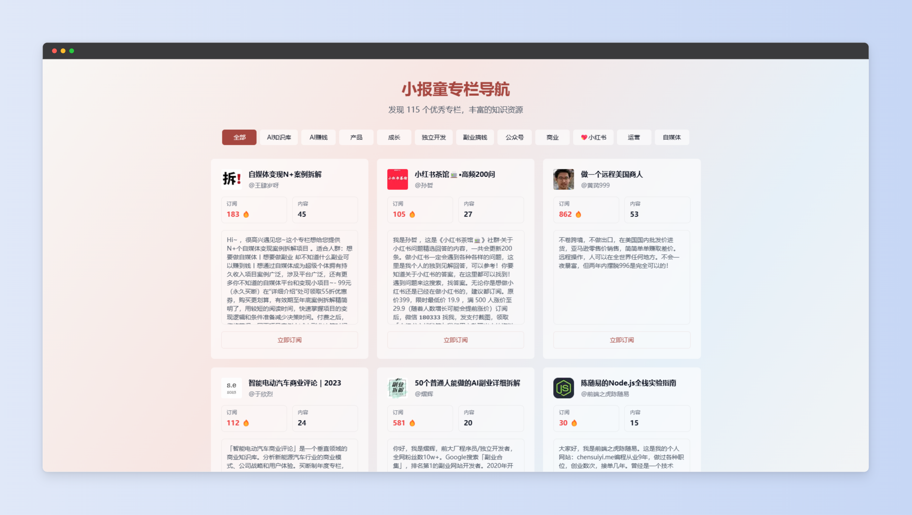

# 小报童导航



一款基于 Cursor AI 编程开发的小报童专栏导航以及管理系统，支持快速构建自己的小报童导航网站，获取用户购买小报童专栏后的返利。

在线预览地址：[https://xiaobot.devooo.top/](https://xiaobot.devooo.top/)

### 功能特色

- 支持根据小报童地址自动批量抓取小报童专栏信息，免去手动添加的困扰。
- 支持后台管理返利码，随时可修改管理返利码。


## 技术栈

- Next.js 14

- TypeScript

- Prisma

- SQLite

- Tailwind CSS

- shadcn/ui

  

## 部署指南

### 环境要求

- Node.js 18.17 或更高版本
- npm 9.0 或更高版本

### 快速部署

**部署注意要点：**

1. 首次安装依赖因为要安装爬虫的浏览器核心，如果是内地服务器速度可能较慢。
2. 因为项目使用的SQLite数据库，仅支持服务器部署，不支持Vercle、Cloudflare等无服务器部署。
3. 本项目默认文件已带了数据库和专栏数据（含100+小报童专栏），可以直接快速部署，如需要从零部署则删除数据库文件，参考从零开始部署步骤教程。


如果您已获得完整的项目文件（包含数据库和环境配置）：

1. 安装依赖
```bash
npm install
```

2. 构建项目
```bash
npm run build
```

3. 启动服务
```bash
npm run start
```

现在可以访问 [http://localhost:9520](http://localhost:9520) 查看应用。


### 从零开始部署

1. 克隆项目
```bash
git clone https://github.com/alanblogooo/xiaobot-nav.git
cd xiaobot-nav
```

2. 配置环境变量
```bash
# 开发环境
cp .env.local-example .env.local

# 生产环境
cp .env.production-example .env.production
```

修改配置文件中的管理员账号密码：
```env
ADMIN_USERNAME=your_username    # 修改为你的用户名
ADMIN_PASSWORD=your_password    # 修改为你的密码
```

> 注意：必须先配置环境变量文件才能正常使用管理功能

3. 安装依赖
```bash
npm install
```

4. 初始化数据库
```bash
# 初始化数据库（这个命令会自动创建数据库目录和结构）
npm run init
```

> 提示：数据库文件将保存在 database/data/database.db

5. 构建项目
```bash
npm run build
```

6. 启动服务
```bash
npm run start
```

现在可以访问 [http://localhost:9520](http://localhost:9520) 查看应用。


### 数据库维护命令

项目提供了几个实用的数据库维护命令：

- 备份数据库
```bash
npm run backup
```
> 备份文件将保存在 database/data/backups 目录

- 升级数据库结构
```bash
npm run auto-upgrade
```
> 升级前会自动创建备份，升级失败可以使用备份恢复

- 重新始化数据库
```bash
npm run init
```
> 如果数据库已存在会自动创建备份


### 使用 PM2 部署（推荐）

1. 安装 PM2
```bash
npm install -g pm2
```

2. 启动服务
```bash
pm2 start npm --name xiaobot-nav -- start
```

3. 设置开机自启
```bash
pm2 save
pm2 startup
```


### 开发环境

如果您需要在开发环境中运行项目：

```bash
npm run dev
```


### 项目结构

```
xiaobot-nav/
├── database/               # 数据库相关文件
│   ├── data/              # SQLite 数据库文件
│   └── prisma/            # Prisma 配置和模型
├── src/
│   ├── app/              # Next.js 应用路由
│   │   ├── api/         # API 路由
│   │   └── (routes)/    # 页面路由
│   ├── components/      # React 组件
│   ├── lib/            # 工具函数和库
│   ├── hooks/          # React Hooks
│   └── services/       # 服务层代码
├── public/             # 静态资源
└── middleware.ts       # Next.js 中间件
```


### 常用命令

```bash
# 开发环境
npm run dev

# 构建生产版本
npm run build

# 启动生产服务
npm run start

# 代码检查
npm run lint
```


## 故障排除

常见问题：

1. 登录失败
   - 确认使用正确账号密码
   - 如果修改账号密码，确保环境变量文件存在且配置正确

2. 构建失败
   - 确保 Node.js 版本 >= 18.17
   - 清理依赖后重新安装：
     ```bash
     rm -rf node_modules .next
     npm install
     npm run build
     ```


## 许可证

MIT
